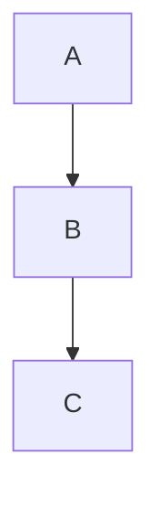
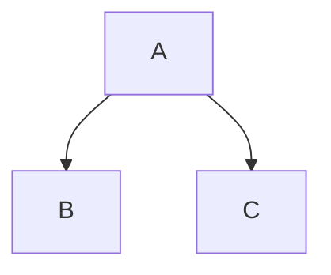
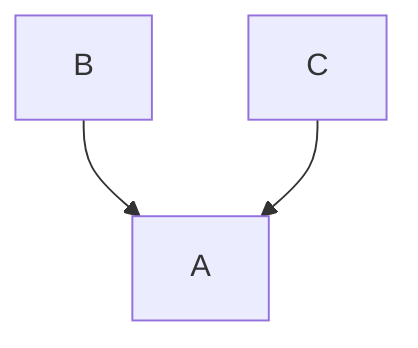

# Week 6 Bayes' Theorem
## Table of Contents
- [Week 1 Data Mining Overview](../week1/README.md)
- [Week 2 Data Types and Preparation](../week2/README.md)
- [Week 3 Data Exploration](../week3/README.md)
- [Week 4 Decision Tree Induction](../week4/README.md)
- [Week 5 Performance Evaluation](../week5/README.md)
- **&rarr;[Week 6 Bayes' Theorem](README.md)**
- [Week 7 Other Classification Methods](../week7/README.md)
- [Week 8 Association Rule](../week8/README.md)
- [Week 9 Cluster Analysis: K-Means and Hierarchical](../week9/README.md)
- [Week 10 Alternative Cluster Analysis and Performance Evaluation](../week10/README.md)

## Bayes' Theorem

### Introduction with Mammogram Example

- confusion matrix approach of having breast cancer with a positive results

#### The value of Mammogram Screen Test

- if a oman has breast cancer, 90% chance that she will have a positive mammogram
- if a woman does not have breast cancer, 7% chance that she will ahve  a positive mammogram
- the probability that a woman has cancer is 0.8%
- image a woman who has a positive mammogram.
  - **What is the probability that she actually has breast cancer**
    - approach using confusion table
    - which model performance metric

|            |positive|negative|total|
|-           |-       |-       |-    |
|      cancer|7       |1       |8    |
|   no cancer|69      |923     |992  |
|total       |76      |924     |1000 |

#### Conditional Probability, Prior, and Posterior Probability

- random variable (rv): values of the variable is the outcome of statistical experiment
- an **event** is an outcome of an experiment
  - for example, tossing a fiar coin leads to two possible outcomes, either head or tail
  - the **probability** of an event as P(E): the fraction of the times event E is observed in a potientially infinte number of experiemnts
    - balanced coin: either head or tail occurs 50% of the time
    - p(head) =0.5
    - p(tail) =0.5
    - p(head)+p(tail)=1

#### joint probability
- captures the probability of an event described by multiple random variables
  - the chance that two events E1 and E2 both occurred
  - the variables are separated by , or &and; P(E1=ei,E2=ej)
  - **independence** of variables means that P(E1,E2)=P(E1)P(E2)
    - event E1, coin_1=head
    - event E2, coin_2=head
    - P(E1,E2)=P(coin_1=head,coin_2=head)

#### conditional probability

- the probability that some event happends given some evidence
  - $P(O1|E1)=\frac{P(O1,E1)}{P(E1)}$
    - out of all times that E1 happens, when does O1 also happen?
- **conditional independence** occurs when the outcome does not depend on the evidence
  - P(O1,E1)=P(O1)

#### Prior Probability and POsterior probability

- prior probability: captures the uncertainty about and event, typically just called prior
P(X=x1)

- posterior probability in classification problem is the probability of assigning certain class label (Y) given a specific set of evidence (X)
P(Y|X)

- a special case of conditional probability

#### Independent Events

- The occurrence of one event does not depend on the occurrence of the other event
  - P(A|B)=P(A), P(B|A)=P(B)
- for example, toss two fair coins, and both landed head up
  - event A coin_1 = head
  - event B coin_2 = head

$$P(A,B)=P(coin_1=head,coin_2=head)$$
$$=P(coin_2=head|coin_1=head)*P(coin_1=head)$$
$$=P(coin_2=head)*P(coin_1=head)$$
$$=0.5*0.5=0.25$$

#### Dependent Events
- the occurrence of one event is dependent on the occurrence of another event
- eg the occupance of a word in a sentence is depended on the previous word(s)
  - event A: "I" is the first word
  - event B: "am" is the second word
  - P(A,B) = P("I","am") =! P("I") * P("am")
  - P(A,B) = P(A) \* P(B|A) = P("I") \* P("am"|"I")

## Live Session

- bayes theorem
- bayesian networks

### Bayes' Theorem

- Bayes' theorem is condition probability that cna be used for probabilistic predictions

$P(y|x)=\frac{P(x|y)P(y)}{P(x)}$

- P(y|x): the posterior probability of y given x
  - > if x is true, how likely will y occur
- P(x|y): a conditional probability of x given y
  - > if y is true what is the likelihood x occurs
- P(y): probability of y occurring AKA prior probability
- P(x): probability of x occurring AKA marginal probability

#### Directed Graphs Represent Causality

- bayesian networks rely on graphs to determine causality for predictions
- the node represents the state
- the edge represents the state transitions

**serial**

**fork**

**collider**

#### Bayesian Networks Use Causal Networks
- bayesian networks use chained bayes functions to represnt complex probabilistic
- users will define the causaility of the relationships and plug in the probabilities of given conditions
- generally, directed aclyclic graphs (DAGs) are used to represent the causaility of the relationships

### Bayes Theorem Overview
- returns a probability
- transparent transaction
- requires human checking of dependencies for networks
- assumes good understanding of data space

### homework

#### Q1

- y is 3 different classes - flu, cold, and alergies
- p(x|y)
  - if someone has the flue 70% chance of fever
    - 30% don't have a fever
  - if someone has a cold, theres 40$ chance of fever
    - 60% don't have a fever
  - if someone has alergies, theres 10% chance of a fever
- p(x) = prob of fever given flue * prop of flu + prob fever given  of flu * prob fever + prob of 

#### Q2
