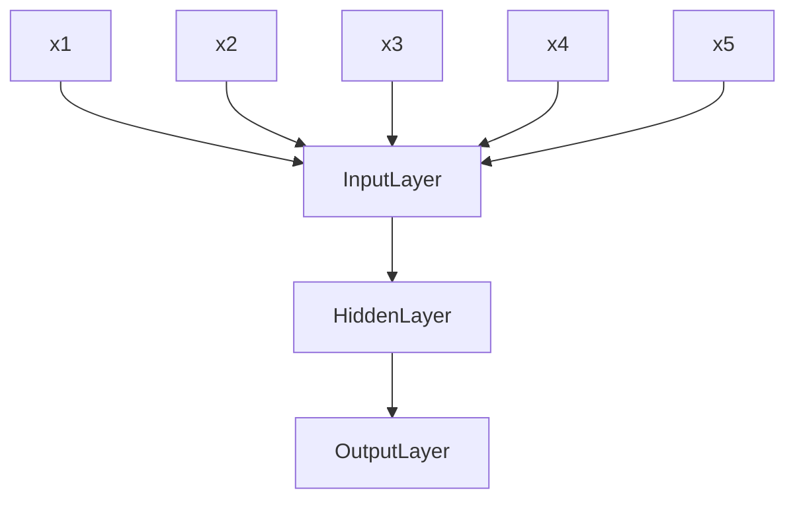

# Week 7 Other Classification Methods
## Table of Contents
- [Week 1 Data Mining Overview](../week1/README.md)
- [Week 2 Data Types and Preparation](../week2/README.md)
- [Week 3 Data Exploration](../week3/README.md)
- [Week 4 Decision Tree Induction](../week4/README.md)
- [Week 5 Performance Evaluation](../week5/README.md)
- [Week 6 Bayes' Theorem](../week6/README.md)
- **&rarr;[Week 7 Other Classification Methods](README.md)**
- [Week 8 Association Rule](../week8/README.md)
- [Week 9 Cluster Analysis: K-Means and Hierarchical](../week9/README.md)
- [Week 10 Alternative Cluster Analysis and Performance Evaluation](../week10/README.md)

### Artificial Neural Networks

- 3 binary inputs x1, x2, x3
- output y
- output y is 1 if at least two of the three inputs are equal to 1

#### perceptron
- input nodes
- output nodes

$$Y=I(0.3X_1+0.3X_2+0.3X_3-0.4>0)$$
I(z)=1 if z is true, 0 otherwise

#### ANN Architecture

- model is an assembly of interconnected nodes and weighted links
- output node sums up each of its input value according to the weights of its links
- compare output node against some threshold t

- perceptron
$$Y=I(\sum_i{w_i}X_i-t)$$
$$Y=sign(\sum_i{w_iX_i-t})$$

#### General Structure of ANN

training ANN means learning the weights of the neurons

#### Algorithm for learning ANN
- initialize the weights (w0, w1,..., wk)
- adjust the weights in such a way that the output of ANN is consistent with class labels of training examples
- Objective function:
$$E=\sum_i[Y_i-f(w_iX_i)]^2$$
- find the weights $w_i$s that minimize the above objective function
  - eg backpropagation algorithm

#### Characteristics of ANN
- tolerate redundant or irrelevant features
- sensitive to noisy data
- missing value handling
- expensive hypothesis space
- training time vs prediction time
## Live Session

Agenda
- ensemble methods
  - bagging
  - random forests
  - error output coding

Ensemble methods combine multiple classifiers together to improve accuracy.
When classifiers are independent adding more classifiers will improve the accuracy and lower the error rate of the classification

### Ensemble methods techniques

1. manipulate the training data
   - bagging
   - boosting
2. Manipulating the features
   - random forests
3. Manipulating the class labels
   - error-correcting outputs
4. Manipulate the learning algorithm
   - changing the neural network topography

#### Bagging AKA bootstrap aggregation

- training
  - bagging retrains classifiers using resubstitution N times and saves the models
- testing
  - input data into all classifiers and sum the classification values for classification value

#### Random Forests

- Random forests randomly select features for decision trees
- voting of most selected class will be selected as the correct class
